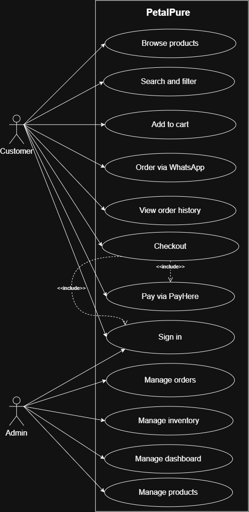
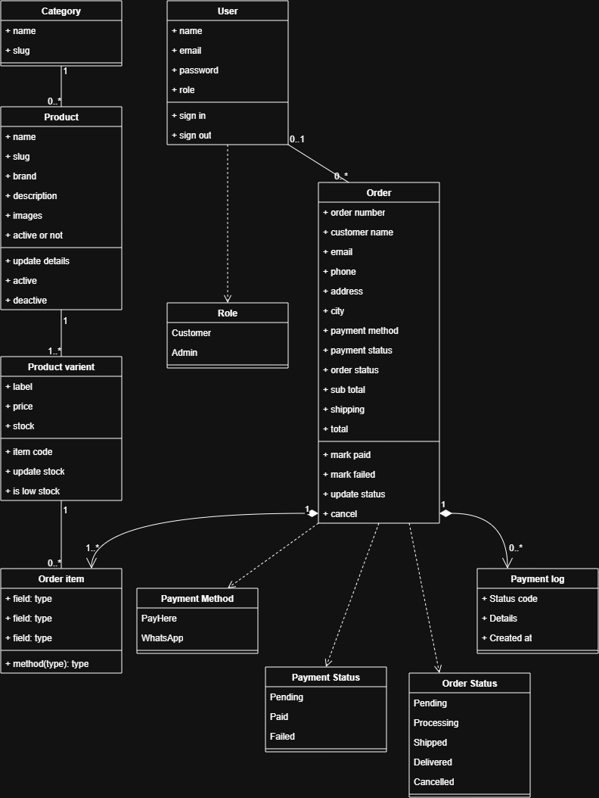
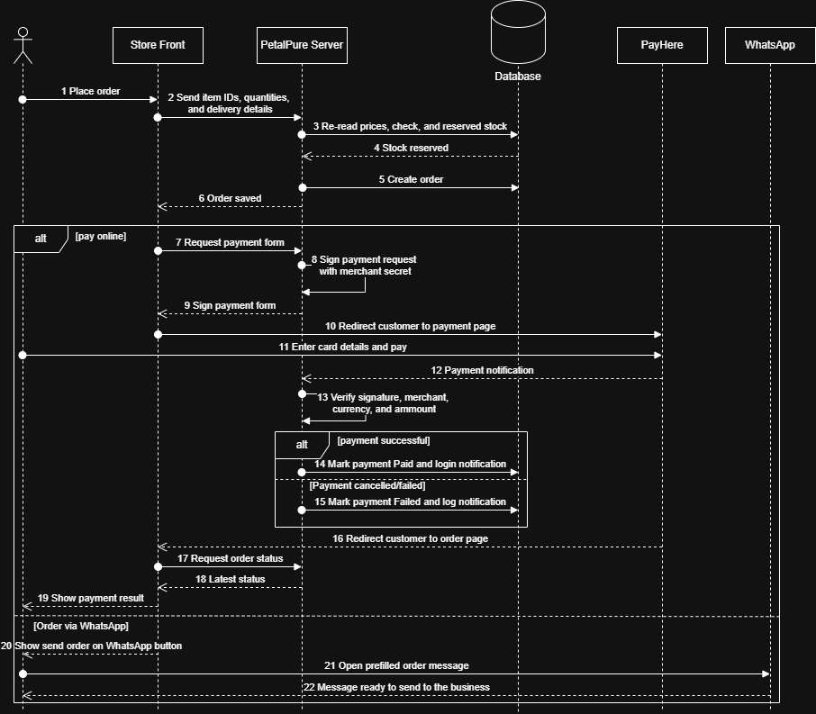
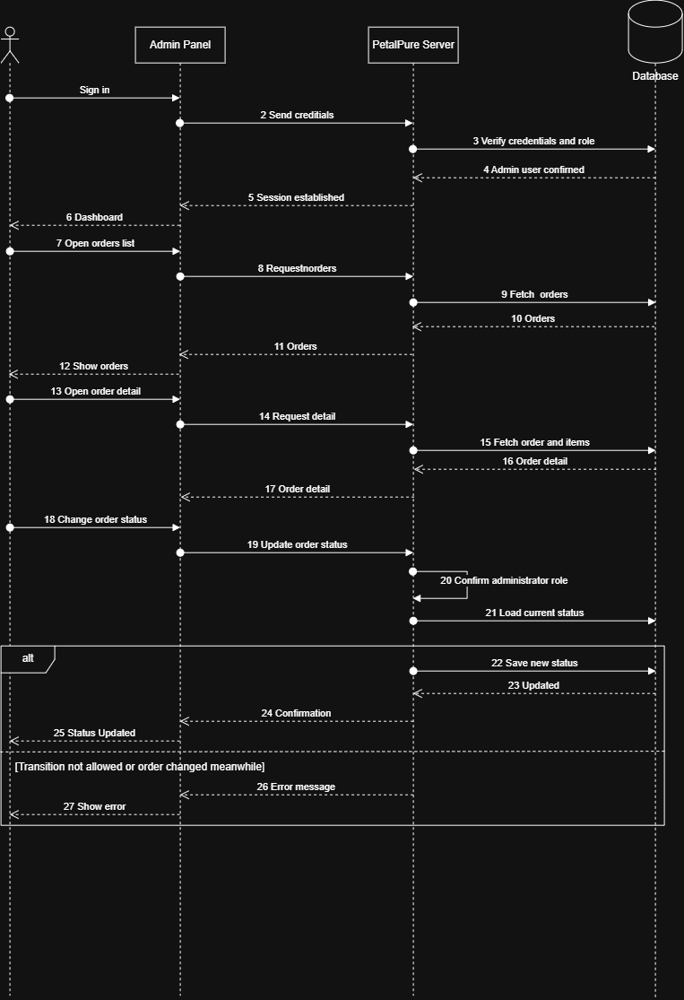
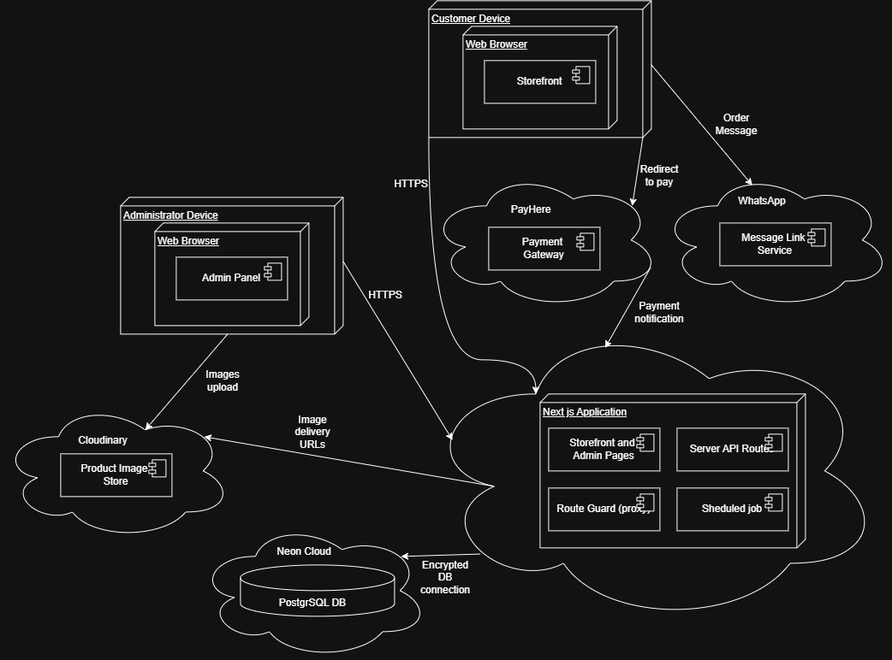

# 🌸 PetalPure: Cosmetics & Beauty E-Commerce Store

[](https://petalpure.vercel.app)
[](https://github.com/Dunith-Code/petalpure/actions/workflows/ci.yml)


A responsive full-stack online store for a cosmetics retailer (creams, shampoos, lotions, skincare), with a customer storefront and an admin panel.

- **Live app:** https://petalpure.vercel.app
- **Repository:** https://github.com/Dunith-Code/petalpure
- **Admin panel:** https://petalpure.vercel.app/admin

---

## 🧩 Features

**🛍️ Storefront**
- Product browsing with search, category filter, sorting and pagination
- Product pages with size/variant selection, stock status and an image gallery
- Persistent cart that is re-validated against the server (prices, stock, availability)
- Customer accounts and order history

**💳 Checkout (two options)**
1. **PayHere Sandbox:** signed payment request with a server-verified callback.
2. **Order via WhatsApp:** the order is saved first, then a readable message with the full cart and delivery details is sent to the business WhatsApp number.

**🗂️ Admin panel**
- Dashboard with orders today, pending orders, paid revenue and low-stock count
- Category management
- Product management with variants (size, SKU, price, stock) and image upload
- Inventory view with inline stock updates and low-stock highlighting
- Order management: filters, search, detail view, status workflow, payment status

---

## 🧰 Tech stack

| Layer | Choice |
|---|---|
| Framework | Next.js 16 (App Router), React 19, TypeScript |
| Styling | Tailwind CSS v4, soft pastel theme, mobile-first |
| Database | PostgreSQL (Neon in production, local in development) |
| ORM | Prisma 6 |
| Authentication | Argon2 password hashing, JWT (jose) in an httpOnly cookie |
| Validation | Zod |
| Images | Cloudinary (signed uploads) |
| Payments | PayHere Sandbox |
| Client state | Zustand (cart, persisted in localStorage) |
| Testing and CI | Vitest, GitHub Actions |
| Hosting | Vercel |

---

## 🏗️ Architecture overview

PetalPure is a single Next.js application with four layers:

1. **Pages (React):** server components query the database directly. Client components handle interactivity (cart, forms, buttons).
2. **API routes (`src/app/api`):** REST endpoints for auth, cart validation, checkout, PayHere, admin operations and a scheduled job.
3. **Domain logic (`src/lib`):** checkout and stock reservation, PayHere signing and verification, WhatsApp message building, auth and validation. Pure logic lives here so it can be unit-tested.
4. **Data (Prisma → PostgreSQL):** typed queries and versioned migrations.

A request guard (`proxy.ts`) protects the admin area. External services are PayHere (payments), Cloudinary (images) and WhatsApp (a prefilled message link). The deployment diagram below shows how these pieces connect.

```
src/
  app/
    (store)/        storefront pages (home, products, cart, checkout, orders, account)
    (auth)/         login and register
    admin/          admin panel pages
    api/            REST routes (auth, checkout, cart, payhere, admin, cron)
  components/       UI (store, admin, auth)
  lib/              auth, db, validators, checkout, payhere, whatsapp, rate limiting
  store/            cart store
prisma/             schema, migrations, seed scripts
tests/              unit tests for payment, WhatsApp and order-state logic
.github/workflows/  CI (lint, typecheck, tests)
docs/diagrams/      use case, class, sequence and deployment diagrams
vercel.json         scheduled job configuration
```

---

## 👥 Use Case Diagram



Two actors use the system. The **Customer** browses, searches, views products, manages a cart, places an order and pays either online (PayHere) or through WhatsApp, then reviews order history. Guest checkout is allowed, so signing in is optional for ordering. The **Administrator** signs in to a separate area and uses the dashboard to manage categories, products, inventory and orders. Every admin action re-checks the role against the database, so the boundary between the two actors is enforced on the server and not only in the UI.

---

## 🗄️ Class Diagram and Database Design



The class model describes the domain and maps directly to the database tables:

- **User** places zero or more **Orders**. Roles are `CUSTOMER` or `ADMIN`.
- **Category** contains zero or more **Products**.
- **Product** offers one or more **Product Variants**. Price and stock live on the variant, so one product can have 50ml and 100ml at different prices.
- **Order** includes one or more **Order Items**. Each item snapshots the product name, variant label and unit price, so later edits never alter past orders.
- **Product Variant** appears in zero or more **Order Items**.
- **Order** records zero or more **Payment Logs**, which keep every PayHere callback for auditing.

Design decisions:

| Decision | Reason |
|---|---|
| Money stored as `Decimal(10,2)` | Floating point causes rounding errors |
| Unique `orderNumber`, `sku` and product `slug` | Customer-facing identifiers and clean URLs must never collide |
| Order items snapshot name and price | Past orders stay accurate when the catalogue changes |
| `userId` on Order is optional | Supports guest checkout |
| Order items and payment logs cascade with their order | No orphaned rows |
| Foreign keys are indexed | Fast filtering by category, product and user |

---

## 🔄 Order lifecycle

`PENDING → PROCESSING → SHIPPED → DELIVERED`, with `CANCELLED` allowed from `PENDING` or `PROCESSING`. Transitions are enforced on the server and applied with a guarded write, so two admins cannot conflict. Payment status (`PENDING`, `PAID`, `FAILED`) is tracked separately.

**Stock** is reserved when an order is created and restored when it is cancelled, in the same database transaction as the status change.

---

## 💳 Sequence Diagram: Customer Checkout and Payment



1. Checkout creates the order on the server. All prices are recomputed from the database and stock is reserved atomically (`UPDATE ... WHERE stock >= qty`).
2. The server signs the payment request: `MD5(merchant_id + order_id + amount + currency + MD5(secret))`. The secret never reaches the browser.
3. PayHere calls `/api/payhere/notify`. The server verifies the **signature, merchant ID, currency and amount** against its own stored order, then marks the order as paid **idempotently** and logs the payload.
4. The return page only displays the status. It never marks an order as paid.
5. A failed or cancelled payment keeps the stock reserved so the customer can retry. A scheduled job cancels unpaid PayHere orders after one hour and returns their stock.

---

## 🧾 Sequence Diagram: Administrator Manages an Order



The administrator signs in, the server verifies the credentials and the role, and a session cookie is issued. The orders list and order detail are loaded from the database. A status change is validated against the allowed transitions and saved. Cancelling an order also returns its reserved stock.

---

## 💬 WhatsApp order flow

The order is saved, with stock reserved, before WhatsApp opens. The confirmation page shows a **Send order on WhatsApp** button that opens `wa.me/<number>` with a message built **on the server from stored order data**. Items are grouped per product, for example:

```
🌸 New PetalPure order PP-K7M2XQ

- Rose Hydrating Face Cream — 50ml × 2, 100ml × 1
- Argan Repair Shampoo — 250ml × 1

Subtotal: Rs. 15,100
Delivery: Rs. 350
Total: Rs. 15,450

Name: ...
Phone: ...
Address: ...

Payment: to be arranged here (bank transfer or cash on delivery)
```

The admin then confirms the order in the chat and marks payment as received.

---

## 🧠 Key technical decisions

| Decision | Reason |
|---|---|
| One Next.js app for UI and API | One codebase and deployment, shared types, server components read the database directly |
| PostgreSQL with Prisma | Orders, items and variants are relational and need transactions. Prisma gives typed queries and migrations |
| Prisma 6, pinned | The newest major version changes the CLI and configuration, and I chose a stable known-good version |
| Server recomputes everything | The browser cart sends only variant IDs and quantities. Prices, totals and stock never come from the client |
| Guarded atomic stock update | Prevents overselling when two customers buy the last unit |
| Stock reserved at order creation | The customer can always buy what they pay for, and unpaid orders expire and release stock |
| Return page never marks an order paid | Only the signature-verified server-to-server callback can change payment status |
| JWT in an httpOnly cookie | Not readable by scripts. Admin access is also re-checked in the database |
| Local database for development, Neon for production | Removes network latency while developing |

---

## 🔐 Security approach

- **Passwords:** Argon2 hashes. Roles are assigned on the server only, so registration always creates a `CUSTOMER`.
- **Sessions:** JWT in an `httpOnly`, `SameSite=Lax`, `Secure` (in production) cookie.
- **Admin protection in two layers:** `proxy.ts` blocks `/admin` and `/api/admin` for non-admins, and every admin handler calls `requireAdmin()`, which re-checks the role in the database.
- **The server never trusts the client:** prices, totals and stock are recomputed server-side.
- **Validation:** Zod on every API input. Prisma uses parameterised queries, and React escapes rendered output.
- **Login hardening:** generic error message, equalised timing, and rate limiting on auth, cart, checkout and payment endpoints.
- **Payments:** signed requests, verified callbacks, amount and currency cross-checks, idempotent updates, payload logging.
- **Secrets:** environment variables only. `.env` is git-ignored and `.env.example` documents every variable. Secrets never use the `NEXT_PUBLIC_` prefix.
- **Uploads:** admin-only signed Cloudinary uploads with type and size checks.
- **Headers:** `X-Content-Type-Options`, `X-Frame-Options`, `Referrer-Policy`, `Permissions-Policy`.
- **Errors:** user-facing error pages never expose internals. Details go to server logs.

---

## ☁️ Deployment Diagram



The application runs on Vercel with Neon PostgreSQL (function region next to the database). Customer and administrator browsers talk to the Next.js server over HTTPS. The server connects to Neon for data, to Cloudinary for image storage, and to PayHere for payment requests and callbacks. The customer's browser is redirected to PayHere for payment and opens WhatsApp with a prefilled order message. `postinstall` runs `prisma generate`, migrations are applied with `prisma migrate deploy`, and `vercel.json` schedules the unpaid-order expiry job.

---

## 🚀 Local setup

Requirements: Node.js 20.9+ (22 recommended), PostgreSQL, a free Cloudinary account.

```bash
git clone https://github.com/Dunith-Code/petalpure.git
cd petalpure
npm install
cp .env.example .env        # Windows PowerShell: Copy-Item .env.example .env
# fill in the values in .env
npx prisma migrate deploy
npx prisma db seed          # creates the admin, categories and sample products
npm run dev
```

Open http://localhost:3000. Optional sample orders: `npx tsx prisma/seed-orders.ts`.

To change the admin password on any database, set `DATABASE_URL`, `ADMIN_EMAIL` and `ADMIN_PASSWORD` for the session and run `npx tsx prisma/set-admin-password.ts`.

### 🔑 Environment variables

| Variable | Purpose |
|---|---|
| `DATABASE_URL` | PostgreSQL connection string |
| `JWT_SECRET` | Random secret (32+ characters) for session tokens |
| `APP_URL` | Public site URL, used to build PayHere return and notify URLs |
| `CLOUDINARY_CLOUD_NAME`, `CLOUDINARY_API_KEY`, `CLOUDINARY_API_SECRET` | Image uploads |
| `NEXT_PUBLIC_WHATSAPP_NUMBER` | Business number, country code without `+` |
| `PAYHERE_MERCHANT_ID`, `PAYHERE_MERCHANT_SECRET`, `PAYHERE_SANDBOX` | PayHere credentials (`true` for sandbox) |
| `CRON_SECRET` | Protects the expiry job endpoint |
| `SEED_ADMIN_EMAIL`, `SEED_ADMIN_PASSWORD` | Used only by the seed script |

---

## 🧪 How to test the app

- **Storefront:** browse, search and filter, open a product, choose a variant, add to the cart, review the cart.
- **PayHere (sandbox):** choose *Pay online with PayHere* at checkout and pay with a PayHere sandbox test card (any future expiry and CVV). The order page changes to *Payment received*, and the order shows as Paid in the admin. Cancelling on PayHere's page shows *Try payment again*.
- **WhatsApp:** choose *Order via WhatsApp*, place the order, then use *Send order on WhatsApp*.
- **Admin:** sign in at `/admin` with the supplied credentials, then manage categories, products and images, adjust inventory, and move orders through their statuses.
- **Security checks on the live site:** a forged PayHere callback returns **400**, and the scheduled-job endpoint without its secret returns **401**.

---

## 🧹 Code quality

```bash
npm run lint        # ESLint
npm run typecheck   # TypeScript, no emit
npm test            # Vitest unit tests (payment hashing, WhatsApp message, order states)
```

GitHub Actions runs all three on every push and pull request. Commits follow the conventional style (`feat:`, `fix:`, `docs:`, `chore:`).

---

## ⚠️ Assumptions and limitations
- **PayHere sandbox limitation:** PayHere only accepts a top-level domain or a mobile app package name when registering a domain/app entry, and rejects `*.vercel.app` because it is a shared-hosting subdomain. The sandbox merchant entry is registered on a local origin, and the end-to-end payment flow is demonstrated on `http://localhost:3000`. The deployed server-side callback is verified: a forged callback returns **400** and the scheduled-job endpoint without its secret returns **401**. A production deployment would register a real top-level domain.
- **WhatsApp orders:** payment is arranged in the chat (bank transfer or cash on delivery), and the admin marks it as paid manually.
- **Guest checkout** is allowed. The order confirmation page is reachable through an unguessable order ID.
- **Delivery** is a flat fee (Rs. 350). There are no shipping zones, taxes or discount codes.
- **Rate limiting is in-memory**, so it resets on cold starts and is not shared across serverless instances. Production should use Redis or Upstash.
- **No Content-Security-Policy yet.** It needs careful tuning for the PayHere form post and Cloudinary.
- **Price sorting happens in memory**, which suits a small catalogue. A larger one would store a minimum-price column.
- **The expiry job runs once a day** on Vercel's free plan. A payment that arrives after an order expired is flagged on the order page for manual handling.
- **Sessions are stateless JWTs** (7 days). Logging out clears the cookie, but there is no server-side revocation list. Admin access is re-checked against the database on every request.
- **Not included:** email notifications, refunds, password reset and end-to-end tests. Unit tests cover the pure business logic only.
- **Neon's free tier sleeps when idle**, so the first request after a quiet period can be slow.

---

## 🔮 Future improvements

Redis-based rate limiting, a Content-Security-Policy, email notifications, refunds, password reset, delivery zones and discount codes, end-to-end tests, and a stored minimum-price column for sorting.